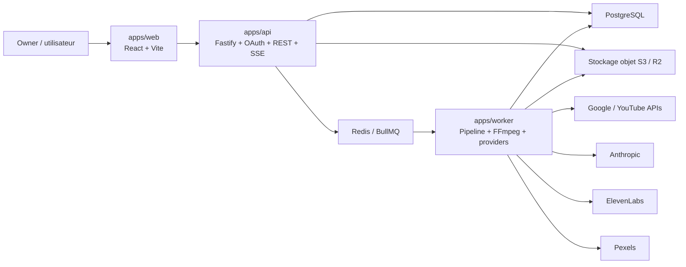

# ViraxStudio

ViraxStudio est une plateforme full-stack pour automatiser une chaine YouTube de A a Z sans quitter l'application.

L'objectif du projet est simple:
- connecter un compte Google/YouTube en toute securite
- stocker les secrets cote serveur, chiffres au repos
- generer des idees, un script, des scenes, des assets, une voix off et une video
- uploader la video sur YouTube en prive
- permettre une review humaine
- publier immediatement ou programmer la publication depuis l'application

Ce depot ne contient pas seulement un site web. Il contient toute l'architecture de la plateforme:
- un front React/Vite
- une API Fastify
- un worker BullMQ
- un package partage pour les contrats, la logique d'etat, le schema de base et le chiffrement

Site public actuel du front:
- https://viraxstudio.levelingcoder.com

## Table des matieres
- [1. Ce que fait ce projet aujourd'hui](#1-ce-que-fait-ce-projet-aujourdhui)
- [2. Vision produit](#2-vision-produit)
- [3. Architecture generale](#3-architecture-generale)
- [4. Structure du monorepo](#4-structure-du-monorepo)
- [5. Parcours utilisateur complet](#5-parcours-utilisateur-complet)
- [6. Comment les donnees circulent](#6-comment-les-donnees-circulent)
- [7. Packages utilises et a quoi ils servent](#7-packages-utilises-et-a-quoi-ils-servent)
- [8. Frontend web](#8-frontend-web)
- [9. Backend API](#9-backend-api)
- [10. Worker et pipeline video](#10-worker-et-pipeline-video)
- [11. Package shared](#11-package-shared)
- [12. Base de donnees](#12-base-de-donnees)
- [13. Securite](#13-securite)
- [14. OAuth Google et connexion YouTube](#14-oauth-google-et-connexion-youtube)
- [15. API publique interne du projet](#15-api-publique-interne-du-projet)
- [16. Variables d'environnement](#16-variables-denvironnement)
- [17. Installation locale](#17-installation-locale)
- [18. Scripts npm](#18-scripts-npm)
- [19. Build, tests et qualite](#19-build-tests-et-qualite)
- [20. Deploiement](#20-deploiement)
- [21. Limites actuelles](#21-limites-actuelles)
- [22. Roadmap logique](#22-roadmap-logique)

## 1. Ce que fait ce projet aujourd'hui

Etat actuel du depot:
- le front parle uniquement au backend
- les secrets ne doivent plus etre la source de verite dans le navigateur
- le backend gere la session owner, les integrations, les runs, la review et les demandes de publication
- le worker gere la generation de contenu, le rendu, l'upload prive et la publication YouTube
- le package shared contient les types et schemas communs aux differents services

Le projet est deja operationnel sur plusieurs briques importantes:
- connexion Google/YouTube cote serveur
- stockage chiffre des secrets
- creation de runs
- suivi des etapes d'un run
- pipeline de generation avec fallback si certains providers ne sont pas configures
- file de review
- publication ou programmation de publication

Important a comprendre:
- certaines etapes utilisent aujourd'hui des fallbacks techniques pour garantir le fonctionnement du pipeline
- par exemple, si Anthropic n'est pas configure, le worker genere un script de secours
- si ElevenLabs n'est pas configure, le worker genere un silence audio de la bonne duree
- si Pexels n'est pas configure, le worker fabrique un visuel SVG placeholder
- le rendu video actuel genere une base video propre mais encore simple, avec FFmpeg

Autrement dit:
- la colonne vertebrale produit est la
- certaines parties sont deja robustes
- certaines parties sont encore des versions 1 a enrichir pour atteindre une production "premium"

## 2. Vision produit

ViraxStudio est pense comme une console d'automatisation YouTube.

Le cas d'usage cible:
1. l'owner connecte son compte Google
2. l'application recupere la chaine YouTube autorisee
3. l'owner configure ses providers IA et ses reglages pipeline
4. il lance un run manuel ou attend la creation automatique via le scheduler
5. le worker genere le contenu complet
6. l'upload YouTube est fait en prive
7. l'owner relit et valide
8. la publication finale se fait depuis l'app

Le projet est actuellement mono-owner:
- une seule personne pilote la plateforme
- si `OWNER_GOOGLE_EMAIL` est renseigne, seul cet email peut ouvrir la session owner
- si `OWNER_GOOGLE_EMAIL` est vide, le premier compte YouTube connecte devient l'owner de reference

## 3. Architecture generale



Lecture simple de cette architecture:
- `apps/web` affiche l'interface et envoie des requetes a l'API
- `apps/api` sert de couche securisee entre le front et le reste du systeme
- `apps/api` envoie les travaux longs dans Redis via BullMQ
- `apps/worker` consomme ces travaux et execute le pipeline reel
- PostgreSQL conserve l'etat metier
- le stockage objet garde les rendus, assets et sous-titres

## 4. Structure du monorepo

Racine du depot:

```text
.
|- apps/
|  |- api/
|  |- web/
|  `- worker/
|- packages/
|  `- shared/
|- .github/
|- AGENTS.md
|- .env.example
|- package.json
`- README.md
```

Description des workspaces:

### `apps/web`
- interface utilisateur
- pages dashboard, connexion chaine, lancement de run, suivi video, review, settings
- ne parle plus directement a Anthropic, ElevenLabs ou YouTube

### `apps/api`
- point d'entree HTTP
- authentification Google
- cookie de session owner
- endpoints REST versionnes sous `/api/v1`
- SSE pour suivre un run en temps reel
- validation et orchestration metier cote serveur

### `apps/worker`
- consommateur de jobs asynchrones
- generation de script
- recuperation ou generation des assets
- generation audio
- creation des sous-titres
- rendu video avec FFmpeg
- upload prive sur YouTube
- publication immediate ou programmee
- scheduler simple pour creer des runs automatiques

### `packages/shared`
- contrats Zod
- constantes partagees
- schema Drizzle/PostgreSQL
- chiffrement AES-256-GCM
- petite logique machine d'etat des runs
- noms des files BullMQ

## 5. Parcours utilisateur complet

Le parcours metier complet est le suivant.

### Etape 1: ouverture de session owner
- l'utilisateur va sur la page channel
- il clique sur "Connecter Google & YouTube"
- le front redirige vers `/api/v1/auth/google/start?mode=redirect`
- le backend cree un `state` OAuth et le stocke dans un cookie
- Google demande le consentement
- Google renvoie vers `/api/v1/auth/google/callback`
- le backend verifie l'identite, la chaine YouTube et le refresh token
- le backend chiffre et stocke ce refresh token
- le backend ouvre une session owner via cookie `httpOnly`

### Etape 2: configuration du coffre-fort
- l'owner ouvre la page settings
- il enregistre ses cles Anthropic, ElevenLabs et eventuellement Pexels
- ces secrets sont chiffres avant d'etre stockes
- le front ne recupere jamais les secrets en clair

### Etape 3: configuration du profil pipeline
- l'owner definit un profil par defaut
- ce profil contient la niche, la duree cible, les options de pipeline et un cron
- ce profil sert aux runs manuels et au scheduler

### Etape 4: creation d'un run
- le front envoie un POST vers `/api/v1/runs`
- l'API cree un `content_run`, ses `run_steps` et sa `review_queue`
- l'API enfile un job BullMQ pour le worker

### Etape 5: execution du pipeline par le worker
- ideation
- generation du script
- creation des scenes
- resolution des assets
- creation de la voix
- generation des sous-titres
- rendu video
- generation thumbnail
- upload YouTube en prive
- bascule en review

### Etape 6: review
- l'owner voit le detail du run dans le front
- il peut approuver ou renvoyer en attente
- l'upload YouTube etant deja fait en prive, la publication finale est rapide

### Etape 7: publication
- l'owner demande "publish now" ou une programmation
- l'API enfile un job de publication
- le worker met a jour l'etat de la video sur YouTube

## 6. Comment les donnees circulent

Le navigateur ne doit plus etre la source de verite pour les secrets.

Flux principal:
1. le front appelle l'API
2. l'API valide, persiste et met en file
3. le worker lit en base, dechiffre les secrets seulement au moment utile
4. le worker appelle les providers externes
5. le worker ecrit les resultats dans PostgreSQL et dans le stockage objet
6. le front relit l'etat depuis l'API
7. le front peut aussi suivre les runs via SSE

Les donnees sensibles:
- refresh token YouTube
- cles Anthropic
- cles ElevenLabs
- cles Pexels eventuelles

Les donnees non sensibles:
- statut des integrations
- nom de la chaine
- metadata de run
- chemins de fichiers stockes
- titres SEO
- progression du pipeline

## 7. Packages utilises et a quoi ils servent

Cette section explique les packages principaux, pourquoi ils ont ete choisis et comment ils sont utilises dans ce depot.

### Racine du monorepo

Le root `package.json` utilise les workspaces npm.

Pourquoi:
- installer toutes les dependances en une seule commande
- partager facilement `@viraxstudio/shared`
- lancer build et test pour tous les workspaces depuis la racine

### Frontend

#### `react`
Role:
- bibliotheque d'interface utilisateur

Usage dans ce projet:
- pilotage du state global applicatif dans `App.jsx`
- rendu declaratif des pages
- affichage reactif de la session, des runs et des integrations

#### `react-dom`
Role:
- rendu React dans le DOM

Usage:
- point d'entree du front dans `main.jsx`

#### `react-router-dom`
Role:
- routage front

Usage:
- pages `/`, `/channel`, `/script`, `/video`, `/publish`, `/settings`
- navigation interne sans rechargement

#### `vite`
Role:
- serveur de dev rapide et build front moderne

Usage:
- dev local rapide
- build de production de `apps/web`

#### `@vitejs/plugin-react`
Role:
- integration officielle React pour Vite

Usage:
- support JSX et confort de dev

### API backend

#### `fastify`
Role:
- framework HTTP Node.js tres rapide

Pourquoi ici:
- architecture simple
- plugins clairs
- bonne base pour une API REST performante

Usage:
- creation de l'app dans `apps/api/src/app.ts`
- declaration des routes auth, runs, reviews, publications, integrations

#### `@fastify/cookie`
Role:
- gestion des cookies

Usage:
- cookie de session owner
- cookie de `state` OAuth Google

#### `@fastify/cors`
Role:
- gestion du Cross-Origin Resource Sharing

Usage:
- autoriser le front a parler a l'API avec `credentials: true`

#### `@fastify/helmet`
Role:
- en-tetes HTTP de securite

Usage:
- durcissement minimum de l'API

#### `@fastify/sensible`
Role:
- helpers pratiques Fastify pour erreurs et reponses

Usage:
- couche utilitaire generale de l'API

#### `zod`
Role:
- validation runtime des donnees

Usage:
- validation des variables d'environnement
- validation des contrats front/back
- schemas de reponses API

#### `dotenv`
Role:
- charger `.env` en local

Usage:
- `apps/api` et `apps/worker` importent `dotenv/config`

#### `drizzle-orm`
Role:
- ORM SQL type-safe

Usage:
- definition du schema PostgreSQL
- requetes type-safe dans l'API et le worker

#### `drizzle-kit`
Role:
- outil de generation de migrations Drizzle

Usage:
- `npm run db:generate`

#### `postgres`
Role:
- client PostgreSQL pour Node.js

Usage:
- connexion bas niveau a PostgreSQL sous Drizzle

#### `google-auth-library`
Role:
- outils OAuth Google

Usage:
- creation de l'URL OAuth
- echange code -> tokens
- refresh access token a partir du refresh token

### Worker

#### `bullmq`
Role:
- file de jobs distribuee sur Redis

Usage:
- deux queues principales:
  - orchestration de run
  - publication
- separation entre API synchrone et traitements longs

#### `ioredis`
Role:
- client Redis robuste

Usage:
- connexion de BullMQ a Redis

#### `@anthropic-ai/sdk`
Role:
- SDK officiel Anthropic

Usage:
- generation du bundle script/SEO/scenes
- fallback si pas de cle ou erreur provider

#### `elevenlabs`
Presence dans le projet:
- installe comme dependance worker

Etat reel d'usage aujourd'hui:
- le code de `voice.ts` appelle directement l'API HTTP ElevenLabs via `fetch`
- le package est donc present mais pas encore exploite comme SDK principal

Pourquoi c'est important de le dire:
- un lecteur humain du README comprend ainsi que la dependance existe, mais que l'integration actuelle utilise encore un appel HTTP direct

#### `@aws-sdk/client-s3`
Role:
- SDK AWS S3 compatible

Usage cible:
- stockage objet compatible S3 / Cloudflare R2

Etat reel actuel:
- le projet a deja une couche `storage.ts`
- le package est pret pour la strategie de stockage objet

### Shared

#### `typescript`
Role:
- typage statique

Usage:
- API, worker, shared sont en TypeScript
- le front est en JSX JavaScript, plus leger

#### `vitest`
Role:
- tests unitaires

Etat actuel:
- `packages/shared` contient des tests
- `apps/api` et `apps/worker` ont les scripts de test mais pas encore de fichiers de test

## 8. Frontend web

Le front se trouve dans `apps/web`.

Pages principales:
- `Dashboard.jsx`: vue d'ensemble des integrations, runs et etapes
- `ChannelSetup.jsx`: connexion owner Google/YouTube
- `ScriptGen.jsx`: creation d'un run
- `VideoBuilder.jsx`: suivi production et rendu
- `Publisher.jsx`: review et publication
- `Settings.jsx`: gestion des integrations secretes, migration legacy et profil pipeline

Responsabilites du front:
- afficher l'etat du systeme
- envoyer des commandes a l'API
- suivre les runs
- rester responsive sur mobile, tablette et desktop

Ce que le front ne doit plus faire:
- conserver les secrets comme source de verite
- parler directement aux APIs sensibles
- gerer lui-meme les tokens Google

Fichier cle:
- `apps/web/src/lib/api.js`

Il centralise:
- la construction des URLs API
- les appels HTTP avec `credentials: include`
- l'ouverture des flux SSE pour les runs

## 9. Backend API

Le backend se trouve dans `apps/api`.

Responsabilites:
- demarrer l'app Fastify
- gerer l'authentification owner
- securiser les secrets
- exposer l'API REST
- creer les runs et pousser les jobs dans BullMQ
- servir l'etat courant de la plateforme au front

Routes declarees:
- `/api/v1/health`
- `/api/v1/auth/session`
- `/api/v1/auth/google/start`
- `/api/v1/auth/google/callback`
- `/api/v1/auth/logout`
- `/api/v1/integrations`
- `/api/v1/integrations/migrate-local`
- `/api/v1/integrations/:provider`
- `/api/v1/pipeline-profiles`
- `/api/v1/pipeline-profiles/default`
- `/api/v1/runs`
- `/api/v1/runs/:runId`
- `/api/v1/runs/:runId/events`
- `/api/v1/reviews`
- `/api/v1/reviews/:runId`
- `/api/v1/publications/:runId`

Organisation interne:
- `routes/`: transport HTTP
- `services/`: logique metier
- `lib/`: helpers techniques
- `db/`: connexion et migration
- `queues/`: push des jobs

Point important:
- l'API expose aussi un flux SSE pour suivre l'evolution d'un run sans recharger la page

## 10. Worker et pipeline video

Le worker se trouve dans `apps/worker`.

Son role:
- executer les taches longues et couteuses
- sortir ces taches du temps de reponse HTTP

Queues utilisees:
- `run-orchestration`
- `run-publication`

Le pipeline actuel execute ces etapes:
- `ideation`
- `script`
- `scenes`
- `assets`
- `voice`
- `captions`
- `render`
- `thumbnail`
- `upload`
- `review`
- `publish`

Ce qui se passe concretement:

### `ideation`
- le sujet est resolu et journalise

### `script`
- `@anthropic-ai/sdk` est utilise si une cle Anthropic est disponible
- sinon un bundle de secours est genere

### `scenes`
- les scenes sont normalisees puis stockees en base

### `assets`
- le worker essaye d'abord Pexels si disponible
- sinon il produit un SVG placeholder et l'upload dans le stockage objet

### `voice`
- le worker essaye ElevenLabs
- sinon il cree une piste audio muette via FFmpeg

### `captions`
- le worker genere un fichier SRT a partir des scenes

### `render`
- le worker appelle FFmpeg
- le rendu actuel produit une base video verticale propre en 1080x1920
- le rendu est volontairement simple aujourd'hui, mais la structure permet de l'enrichir

### `thumbnail`
- le worker fabrique une miniature de base via FFmpeg

### `upload`
- le worker uploade la video sur YouTube en prive
- il tente aussi l'upload de la miniature

### `publish`
- le worker met a jour le statut de confidentialite YouTube
- il peut publier maintenant ou programmer une date

Scheduler:
- le worker contient aussi un scheduler simple
- il lit les profils pipeline
- il evalue un cron
- il cree des runs automatiques s'il faut lancer la cadence

## 11. Package shared

Le package `packages/shared` est essentiel.

Il evite de dupliquer:
- les enums
- les schemas de validation
- la structure de la base
- la logique d'etat minimale
- les noms de queues

Fichiers cle:
- `contracts/`
- `db/schema.ts`
- `server/encryption.ts`
- `server/run-machine.ts`
- `server/queues.ts`

Pourquoi c'est important:
- le front, l'API et le worker "parlent la meme langue"
- les statuts de run restent coherents
- les validations sont centralisees

## 12. Base de donnees

La base PostgreSQL est decrite dans `packages/shared/src/db/schema.ts`.

Tables principales:

### `owner_sessions`
- sessions ouvertes de l'owner
- stockage du hash du token de session, jamais du token brut

### `integrations`
- etat logique des integrations
- provider, statut, label, metadata

### `integration_secrets`
- stockage chiffre des secrets
- utile pour Anthropic, ElevenLabs, Pexels, YouTube refresh token

### `youtube_channels`
- metadonnees de la chaine connectee

### `pipeline_profiles`
- profils de configuration du pipeline

### `content_runs`
- entree principale d'un run de contenu

### `run_steps`
- detail et etat de chaque etape du pipeline

### `jobs`
- suivi technique des jobs de queue

### `scripts`
- contenu editorial genere

### `scenes`
- scenes et narration

### `assets`
- assets visuels, audio, sous-titres

### `renders`
- rendu video final

### `thumbnails`
- miniature associee au run

### `youtube_publications`
- etat de publication YouTube

### `review_queue`
- validation humaine avant publication finale

### `audit_logs`
- journal d'audit metier

## 13. Securite

La securite est une partie centrale du projet.

Mesures deja en place:
- secrets chiffres au repos
- cookies de session `httpOnly`
- session owner cote serveur
- refresh token YouTube conserve cote serveur
- hash SHA-256 des tokens de session
- separation front / API / worker

Chiffrement:
- fichier: `packages/shared/src/server/encryption.ts`
- algorithme: AES-256-GCM
- IV aleatoire de 12 octets
- tag d'authentification
- `keyVersion` prevu dans la structure stockee

Pourquoi AES-256-GCM:
- chiffrement authentifie
- integrite + confidentialite
- bonne pratique moderne pour ce type de coffre-fort applicatif

Ce qui ne doit pas etre fait:
- remettre des cles API en clair dans `localStorage`
- exposer les refresh tokens au front
- commiter un `.env`

## 14. OAuth Google et connexion YouTube

Le flux OAuth est maintenant pense pour etre plus robuste.

Comportement actuel:
- le front redirige vers le backend
- le backend genere l'URL Google
- le backend stocke le `state` dans un cookie
- Google rappelle le backend
- le backend echange le code OAuth
- le backend lit:
  - le profil Google
  - la chaine YouTube du compte
- le backend stocke:
  - les infos de la chaine
  - le refresh token YouTube chiffre

Points importants:
- si le front et l'API sont sur deux domaines differents, les cookies sont adaptes automatiquement
- si `OWNER_GOOGLE_EMAIL` est renseigne, seul cet email est accepte
- sinon le premier compte connecte devient la reference owner

Scopes demandes:
- `openid`
- `email`
- `profile`
- `https://www.googleapis.com/auth/youtube`
- `https://www.googleapis.com/auth/youtube.upload`

Pourquoi ces scopes:
- identifier proprement l'utilisateur
- lier la chaine YouTube
- uploader la video
- modifier le statut de publication

## 15. API publique interne du projet

Le projet expose une API REST interne au front.

### Sante
- `GET /api/v1/health`
- verification simple de disponibilite

### Auth
- `GET /api/v1/auth/session`
- `GET /api/v1/auth/google/start`
- `GET /api/v1/auth/google/callback`
- `POST /api/v1/auth/logout`

### Integrations
- `GET /api/v1/integrations`
- `POST /api/v1/integrations/migrate-local`
- `POST /api/v1/integrations/:provider`

### Pipeline profiles
- `GET /api/v1/pipeline-profiles`
- `PUT /api/v1/pipeline-profiles/default`

### Runs
- `GET /api/v1/runs`
- `POST /api/v1/runs`
- `GET /api/v1/runs/:runId`
- `GET /api/v1/runs/:runId/events`

### Review
- `GET /api/v1/reviews`
- `POST /api/v1/reviews/:runId`

### Publication
- `POST /api/v1/publications/:runId`

## 16. Variables d'environnement

Reference principale:
- `.env.example`

### Variables partagees

#### `WEB_APP_URL`
- URL du front
- sert pour le CORS et les redirections

#### `API_PUBLIC_URL`
- URL publique de l'API
- utile pour la logique de cookies cross-site

#### `OWNER_GOOGLE_EMAIL`
- optionnelle
- si renseignee, seul cet email peut devenir owner
- si vide, le premier compte YouTube connecte devient la reference

#### `COOKIE_SECRET`
- secret signe/cookie

#### `APP_ENCRYPTION_KEY`
- cle de chiffrement base64
- doit decoder en 32 octets pour AES-256-GCM

#### `SESSION_TTL_HOURS`
- duree de vie de session owner

### Variables API et worker

#### `DATABASE_URL`
- connexion PostgreSQL

#### `REDIS_URL`
- connexion Redis pour BullMQ

#### `GOOGLE_OAUTH_CLIENT_ID`
- client OAuth Google

#### `GOOGLE_OAUTH_CLIENT_SECRET`
- secret OAuth Google

#### `GOOGLE_OAUTH_REDIRECT_URI`
- URI exacte de callback Google
- doit aussi etre configuree dans Google Cloud Console

#### `ANTHROPIC_MODEL`
- modele Anthropic a utiliser

#### `DEFAULT_ELEVENLABS_VOICE_ID`
- voix par defaut pour la synthese vocale

#### `DEFAULT_VIDEO_WIDTH`
- largeur cible du rendu

#### `DEFAULT_VIDEO_HEIGHT`
- hauteur cible du rendu

#### `DEFAULT_VIDEO_FPS`
- frame rate cible

#### `FFMPEG_PATH`
- chemin vers le binaire FFmpeg

#### `S3_ENDPOINT`
- endpoint du stockage objet

#### `S3_BUCKET`
- bucket utilise

#### `S3_REGION`
- region du bucket

#### `S3_ACCESS_KEY_ID`
- identifiant d'acces stockage objet

#### `S3_SECRET_ACCESS_KEY`
- secret stockage objet

#### `S3_PUBLIC_BASE_URL`
- base URL publique pour servir les objets

#### `PEXELS_API_KEY`
- optionnelle
- fallback stock portrait pour les scenes

#### `SCHEDULER_POLL_INTERVAL_MS`
- frequence de lecture du scheduler

### Variable front

#### `VITE_API_BASE_URL`
- base URL du backend vue par le front

## 17. Installation locale

Prerequis:
- Node.js 20 recommande
- npm
- PostgreSQL
- Redis
- FFmpeg disponible
- un bucket S3-compatible ou une cible de stockage equivalente

Etapes:

1. Cloner le depot
```bash
git clone https://github.com/Leveling1/viraxstudio.git
cd viraxstudio
```

2. Installer les dependances
```bash
npm ci
```

3. Creer le fichier d'environnement
```bash
copy .env.example .env
```

4. Renseigner les variables
- PostgreSQL
- Redis
- Google OAuth
- chiffrement
- stockage objet
- providers IA

5. Generer la migration
```bash
npm run db:generate
```

6. Appliquer la migration
```bash
npm run db:migrate
```

7. Lancer les 3 services
```bash
npm run dev:api
npm run dev:worker
npm run dev:web
```

Ensuite:
- web: http://localhost:5173
- api: http://localhost:3001

## 18. Scripts npm

Depuis la racine:

### `npm run dev:web`
- lance le front Vite

### `npm run dev:api`
- lance l'API Fastify en mode watch

### `npm run dev:worker`
- lance le worker en mode watch

### `npm run build`
- build `shared`, puis `api`, puis `worker`, puis `web`

### `npm run test`
- lance les tests des workspaces

### `npm run db:generate`
- genere les migrations Drizzle via le workspace API

### `npm run db:migrate`
- applique les migrations via le workspace API

## 19. Build, tests et qualite

Etat actuel:
- `npm run build` passe
- `npm run test` passe
- `packages/shared` contient les tests existants
- `apps/api` et `apps/worker` n'ont pas encore de tests metier complets

Ce que cela signifie:
- la base de typage et de build est saine
- la couverture de tests est encore perfectible sur les couches metier les plus critiques

## 20. Deploiement

Le deploiement actuellement versionne dans le repo concerne le front.

Workflow GitHub Actions:
- fichier: `.github/workflows/deploy.yml`
- declenchement:
  - push sur `main`
  - execution manuelle possible

Ce que fait le workflow:
1. checkout du repo
2. setup Node.js 20
3. `npm ci`
4. `npm run build`
5. deployment FTP de `apps/web/dist/`

Destination web actuelle:
- https://viraxstudio.levelingcoder.com

Important:
- le backend et le worker doivent etre deployes separement
- le README parle donc d'une architecture complete, mais le workflow GitHub fourni ici ne pousse que le front statique

## 21. Limites actuelles

Pour qu'un humain comprenne bien le depot, il faut aussi etre transparent sur les limites.

Limites actuelles importantes:
- rendu video encore simple
- miniature encore placeholder
- pipeline assets encore basique
- usage direct HTTP pour ElevenLabs au lieu du SDK
- peu de tests metier dans `apps/api` et `apps/worker`
- deploiement backend/worker non automatise dans ce repo
- pas encore de vraie observabilite type Sentry, traces ou dashboard d'erreurs

Cela ne veut pas dire que le projet est "incomplet".
Cela veut dire qu'il est structure pour grandir proprement.

## 22. Roadmap logique

Si quelqu'un reprend ce depot, la suite naturelle est:
- enrichir le rendu video scene par scene
- utiliser de vrais templates thumbnails
- ajouter plus de tests API/worker
- ajouter du monitoring
- industrialiser le deploiement backend et worker
- ajouter des providers visuels plus avances
- ajouter une meilleure gestion des retries et erreurs de provider
- raffiner le scheduler et les profils multi-strategies

## Resume court

En une phrase:

ViraxStudio est un monorepo full-stack qui transforme une idee de video YouTube en contenu genere, rendu, uploade, relu puis publie, en gardant la securite des secrets et de l'authentification cote serveur.
